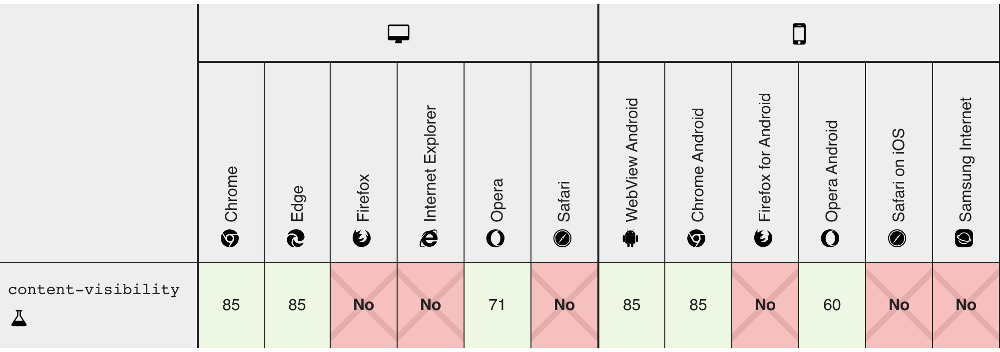

# Why we need to use content-visiblity ?
***
Applying `content-visiblity: auto` to an element tells the browser to skip rendering work for that particular element until it is scrolled into the viewport,
we can use it for each section, where it optimizes initial rendering.

It is available from chrome 85 and in edge 85.

And even we can use `content-visibility: hidden` which is similar to `display: none` which will remove the element from render tree.

